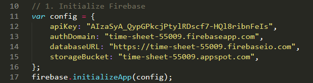
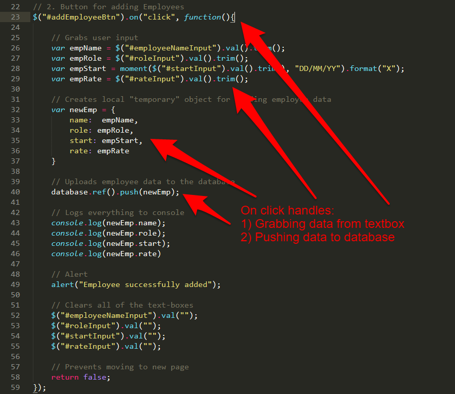
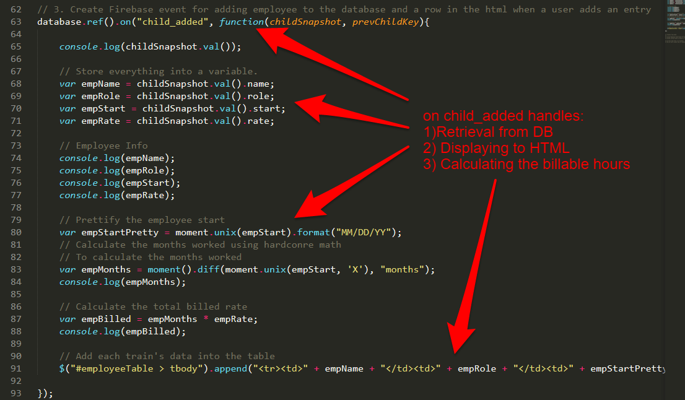

## Day 3 - Firebase application building & Group Projects <!--links--> &nbsp; [⬅️](../02-Day/02-Day-LessonPlan.md) &nbsp; [➡️](../04-Day/04-Day-LessonPlan.md)

### Overview

In this class, we will be using Firebase and MomentJS to create a real-world application for calculating billable hours.

Next, students will have time to work together on their homework.

Last but not least, students will begin work on their first Project of the Bootcamp, an API-powered web application that pulls data from multiple sources in a creative way.

`Summary: Complete Activity 21 in Unit 07 & Start Project`

##### Instructor Priorities

* Prior to class, you will need to create a Firebase database for use in today's lecture. Place the config from the database you create into the `17-TimeSheet` example.

  * **Your Firebase DB Goes Here**

    * `timesheetLogic.js` inside `17-TimeSheet`
      

* Students should complete and understand the Train Prediction Activity

* Students should build their confidence at building applications from scratch

* Students should be introduced to the goals and requirements of Project #1. 

* Students should to identify a project idea, research APIs, and begin initial work outlining their design.

* Each group should submit a Project Proposal by the end of the day.

##### Instructor Notes

* Today's in-class activity is _highly_ related to the Train Time homework assignment, and as such, merits significant effort from students.

* As Instructors / TAs, keep in mind that the success of your students post-bootcamp is largely dictated by the quality of their projects. Encourage and help steer them in every way you can towards high-quality final projects!

* Instructors / TAs, take a few moments before class to review the presentations posted on this link: <https://www.youtube.com/playlist?list=PLe80S_8KApqOTw-2-b-sgzTwwWImepoii>. Do not share these with students, but it will help you understand what's possible! 

* You and the TAs may want to implement a "workshop" series (10-20 mins) with individual groups. In these workshops, student groups will rotate between the Instructor and TAs to get help on specific topics like "Refining Ideas", "Finding the Right API", "Creating a Layout", etc.

* Some popular API choices do not support CORS. Have students use <https://cors-anywhere.herokuapp.com/> as a workaround.

`Note: This approach works best if you can find secluded spaces to work with individual groups.`

* Have your TAs reference [Day-3-Time-Tracker](Day-3-Time-Tracker.xlsx) to help keep track of time during class.

### Sample Class Video (Highly Recommended)
* To view an example class lecture visit (Note video may not reflect latest lesson plan): [Class Video](https://codingbootcamp.hosted.panopto.com/Panopto/Pages/Viewer.aspx?id=5290095e-3a2d-4071-a850-832516d59722)

- - -

### Class Objectives

* To provide a "real-world" application development scenario that utilizes HTML, CSS, Databases, and Data Manipulation

* To introduce students to Project Week, its timeline, and the deliverable requirements

* To provide students an opportunity to brainstorm project ideas and obtain instructor approval for project direction.

- - -
### 1. Welcome back! (2 min)

* Let students know how exciting today will be! They'll get to build an application with _data persistence_, and brainstorm ideas for their first project!

* Students are probably feeling very confused, assure them that they're doing awesome and their knowledge will be reinforced in this next activity!

### 2. Students Do: Main Application - Datetime Manipulation (10 min)

* Open the `timesheetLogic.js` file in `17-TimeSheet`, remind the students what this application did.

* Students will now attempt to complete the Employee Tracker application, utilizing their newfound datetime knowledge to calculate the number of months worked and subsequently the total amount billed.

* Instructors and TAs should be walking around to see how students are doing.

### 3. Instructor Do: Recap the Employee Tracker application (5 min)

* Open the `timesheetLogic.js` file in `17-TimeSheet`.

* Spend a little time reviewing the Employee Tracking Application. Don't expect to walk students through everything. Keep things at a high-level, and encourage students to look back at this working code. It is nearly identical in structure to the TrainTime Homework.

* Key points to emphasize:

  * There are two major `.on` events.

  * The first is the `.on("click")`. This event takes data from the textboxes and relays it to the database.

    

  * The second is the `.on("child_added")`. This event retrieves data from the database and displays it in the HTML. This event gets run both at the beginning of the application's launch and each time a new entry is added to the database.

    

  * Finally, point out that we use moment.js to calculate the difference between the current time and the time of the employee's start date. Let students know that they will have one more example of using MomentJS that will help if they struggled with this part (the next activity).

* Don't get so buried in the explanation of this app that you don't get to the next set of activities. The next few activities are critical to the homework's completion!

### 4. Everyone Do: Traintime Prediction (Math) (10 min)

* Open the Homework-4 solution for TrainTime in the browser. (Alternatively go to <https://train-times-93583.firebaseapp.com/>)

* Remind students how this application works. Point out that, in this application, administrators input the time for the first train of the day and the frequency with which a train arrives at a station. With this information the application AUTOMATICALLY calculates the next arrival time.

* This is trickier than it seems and requires a bit of math.

* Let them know that you won't be giving them the answer to this question.

* Then slack out the following instructions to students:

* **Instructions:**

  * With your group write out the steps you would use "mathematically" to determine the answer to the following situation:

  * Assuming:

    1. The first train of the day comes in at 3:00 AM.
    2. The train runs every 17 minutes
    3. The current time is 7:12 PM.
    4. There have been no delays and will be no delays.

  * Question:
    1. How many minutes away is the next train?

### 5. Everyone Do: Traintime Prediction (Code) (15 min)

* Again, let students know that you won't be giving them the answer.

* Instead, slack out the following:

* **File:**

  * `train-example.html`

* **Instructions:**

  * Using the comments in the code as a guide, determine the mathematical formula for calculating train times.

  * Then explain to one another how the code works (line by line) and how it could be used in relationship to the homework assignment.

### 6. Groups Do: Homework ( mins, remainder of class)

* Put students into groups, and have them get started on their homework.

### 7. Instructor Do: Project Group Formation (5 min)

* As a final activity for the day, let students know the rest of the week is for projects!

* Then, slack out the Team lists along with the below information.

* **Instructions:**

  * Project Goal:

    * Build Something Awesome

  * Requirements:

    * Must uses at least two APIs

    * Must use AJAX to pull data

    * Must utilize at least one new library or technology that we haven’t discussed

    * Must have a polished frontend / UI

    * Must meet good quality coding standards (indentation, scoping, naming)

    * Must NOT use alerts, confirms, or prompts (look into modals!)

    * Must have some sort of repeating element (table, columns, etc)

    * Must use Bootstrap or Alternative CSS Framework

    * Must be Deployed (GitHub Pages or Firebase)

    * Must have User Input Validation
	
  * Presentation Date:

    * One Week from Today

* Be pumped!

### 8. Slack out the Video Guide

* Slack out the video guide for this week's key activities and last week's homework! Emphasize how helpful a tool these videos can be if a student feels as if they are falling behind or simply wants to review the material once again.

### 9. Instructor Do: Present the Project Week Slideshow (25 mins)

* Open up the `API_Project.pptx` file and present each of the slides. Use the `Teams` slide as a cue for breaking students up into teams. 

* Slack out the `API_Project.pptx` file and the `API_Resources.docx` file. 

* Remind students that they will need to complete a half page proposal to instructors by EOD. Let them know that they can just slack you the file. (This doesn't need to be kept for official purposes. It is merely so you have a way to review their final plans for feasibility sake).

- - -

### 10. Lunch (30 min)

- - -

### 11. Project Groups Do: Brainstorm & API Research (120 mins)

* Students begin work with groups to identify ideas, research APIs, and create project designs. 

* At the your discretion, Instructor/TA should begin hosting "workshops" to help steer groups in the right direction. 

* If you prefer not to "workshop", instructors and TAs should circulate and offer guidance on scope of ideas, available APIs, API documentation, etc.

### 12. Instructor Do: Review questions & offer closing thoughts

* Review any overarching questions and offer closing thoughts. 

* Remind them they have all week and encourage them to meet outside of class to work with one another.
