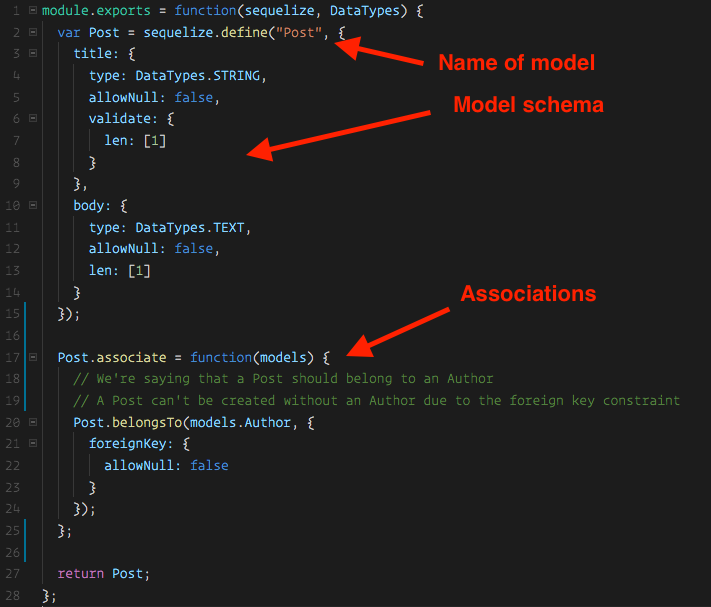
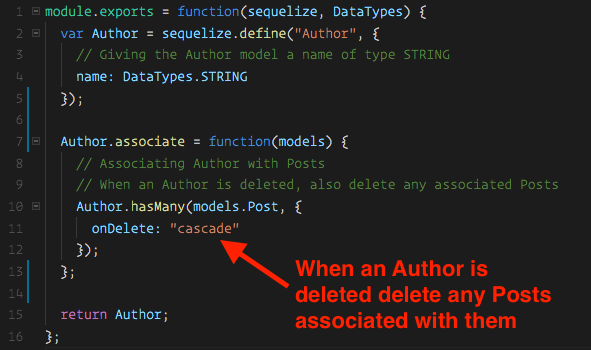
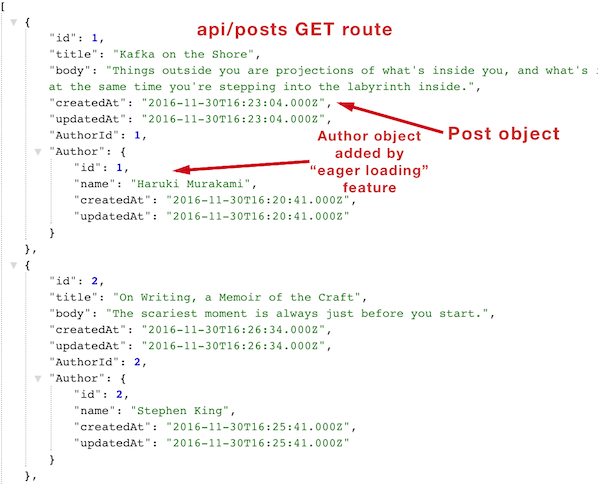
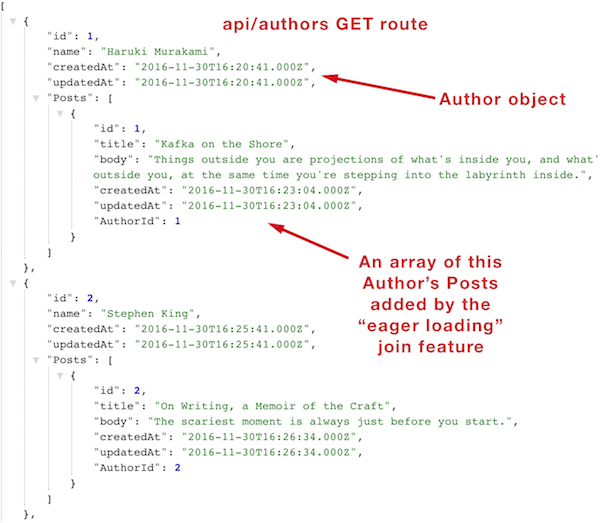

## Day 3 - Joins in Sequelize & Project #2 <!--links--> &nbsp; [⬅️](../02-Day/02-Day-LessonPlan.md) &nbsp; [➡️](../04-Day/04-Day-LessonPlan.md)

### Overview

We will also introduce the concept of joins & relations in Sequelize. Students will begin working on their second project.

`Summary: Complete Activities 15-16 in Unit 15`

* When using any of the `Supplemental PDFs`, please download and open. Do NOT preview on GitHub as they may not display properly in the browser.

##### Instructor Priorities

* Students should become familiar with relations in Sequelize.
* Students should become familiar with the "include" option in order to easily perform queries with joins.

* Students should be introduced to the goals and requirements of Project #2.

* Each group should submit a Project Proposal by the end of the day.

##### Instructor Notes

* As Instructors / TAs, keep in mind that the success of your students post-bootcamp is largely dictated by the quality of their projects. Encourage and help steer them in every way you can towards high-quality final projects!

* Instructors / TAs, take a few moments before class to review the presentations posted on this link: <https://www.youtube.com/playlist?list=PLe80S_8KApqOTw-2-b-sgzTwwWImepoii>. Do not share these with students as they are Rutgers Specific -- however, use the insight you gain in watching these videos to understand what's possible.

* You and the TAs may want to implement a "workshop" series with individual groups. In these workshops, student groups will rotate between the Instructor and TAs to get help on specific topics like "Refining Ideas", "Finding the Right API", "Creating a Layout", etc. These workshops should be between 10-20 minutes each and are intended to ensure students are heading in the right direction. (Note: This approach works best if you can physically remove students from the main classroom and find small spaces to work with individual groups. Be creative here!).

### Sample Class Video (Highly Recommended)
* To view an example class lecture visit (Note video may not reflect latest lesson plan): [Class Video](https://codingbootcamp.hosted.panopto.com/Panopto/Pages/Viewer.aspx?id=90d71a66-f2cc-4500-bdda-a86500f76e47)

- - -

### Class Objectives

* To provide students an opportunity to brainstorm project ideas and obtain instructor approval for project direction.

- - -

### 0. Instructor Do: Welcome Students (1 min)

* Welcome students and let them know that this has historically always been one of the most challenging weeks of the course. Give them praise for making it to Sequelize Day 3. Let's dive right in with a quick review!

- - -

### 1. Instructor Do: Introduce Sequelize Associations (5 mins)

* Explain to the class that what we went over in the last activity is considered a `belongsTo` association, as well as a `hasMany` association in Sequelize. These are some of the most common types of associations.

  * A Post **belongsTo** an Author.
  * An Author **hasMany** posts.

* This may be confusing at first, so we're going to do an exercise to hopefully help make this more clear. This exercise will have some unfamiliar syntax, so instructors and TA's should be walking around offering assistance.

- - -

### 2. Groups Do: Sequelize Associations (20 mins)

* Slack out the following folder and instructions:

  * **Folder:** `14-Post-Author-Association-Unsolved`

* **INSTRUCTIONS:**

  The goal of this exercise is to modify the Post and Author models so that they are associated with eachother.

  1) Open the folder slacked out to you.

  2) Run `npm install`

  3) Open the `config` folder and update the `config.json` file's `development` object to match your own local MySQL database.

  4) Navigate to the `post.js` file.

  5) You will need to set an `associate` property to the `Post` model after it's defined. There's an example of this type of association being done here:
  <https://github.com/sequelize/express-example/blob/master/models/task.js>

  * This may take a few tries to implement correctly in your own Post model (There's a lot of curly braces there!). You can verify your code works by starting your node server and then checking MySQL Workbench. If the Posts table now has a foreign key of AuthorId, you were successful.

  **Bonus**: If you complete the exercise before time's up, navigate to the author.js file and add a **hasMany** association from the Author model to the Post Model. An example of this type of association can be found here:
  <https://github.com/sequelize/express-example/blob/master/models/user.js>

  **Note** After this activity we have just one more step to complete the app and get it fully functioning.

- - -

### 3. Instructor Do: Review Sequelize Associations (20 mins)

* Open the solved version of the previous exercise `14-Post-Author-Association-Solved` in your editor and navigate to the posts.js file.

* Explain to the class that this while this may be some unfamiliar syntax, we don't need to perfectly understand how it all works to use it. A lot of Sequelize code is boilerplate we need not concern ourselves too much with. Nonetheless, it can be helpful to have some understanding:

* Inside of this function we run the `Post.belongsTo` method and pass in some configuration.
* The object's only key is `classMethods` and it's value is another object.
* This inner object has a key of `associate`.
* We specify that we want to associate our `Post` model with `models.Author`.
* We run the **belongsTo** method on Posts and take in models.Author as an argument.
* We're adding a flag to our foreign key (AuthorId) saying this cannot be null. In other words, it won't let us create a Post without an Author.
* **Explain that for the most part they can create an association just by copying and pasting this code. There's no need to worry about memorizing it.**
* Briefly go over the **hasMany** association in the Author model. This was part of the bonus and isn't actually required to put a foreign key on the Post model, but it's VERY helpful as it helps us easily perform joins whether we're doing a find on Posts, or a find on Authors. This will be more clear in the next exercise!
  
* There are other types of associations we can do with Sequelize, but belongsTo and hasMany are some of the most common and what we'll be using here.

  * <http://docs.sequelizejs.com/en/latest/docs/associations/> Sequelize's docs are very thorough when it comes to the different types of relations that are available.

* We're almost done! While we've set up our relations, we haven't actually specified that we want to return joined data to the user inside of our queries, therefore our app won't work as expected quite yet.
* Inform students that in the next activity we're going to direct them to a section of Sequelize's documentation to see if they might be able to figure out how we need to change our queries to make this work.

- - -

### 4. Groups Do: Joins (15 mins)

* Slack out the following folder and instructions:

  * **Folder:** `15-Post-Author-Joins-Unsolved`

* **INSTRUCTIONS:**

  The goal of this exercise is to modify our find queries in both post-api-routes.js and author-api-routes.js to use Sequelize's "include" option. We can use "include" to say that we want to return associated data.

  1) Open the folder slacked out to you

  2) Run `npm install`

  3) Open the `config` folder and update the `config.json` file's `development` object to match your own local MySQL database.

  4) Navigate to the `post-api-routes.js` file.

  5) Add the "include" option to the queries specified in the comments. This is a feature called "eager loading". We want to "include" the Author model. Examples can be found here:
  <http://docs.sequelizejs.com/manual/tutorial/models-usage.html#eager-loading>

  6) Navigate to the `author-api-routes.js` file and add the "include" option to the queries specified in the comments. Here we want to "include" the Post model.

  7) If successful the application should now be fully functional. After you create a few Authors with a few posts, try navigating to either `localhost:8080/api/posts` or `localhost:8080/api/authors` to make sure the JSON returned for both routes includes all of the data.

  **Hint**: The "include" key goes on the same options object as the "where" attribute we've been using. Examples can be found at the link supplied.

- - -

### 5. Instructor: Review Joins (20 mins)

* Slack out the solution to the previous exercise  `16-Post-Author-Joins-Solved`

* Show students how by just adding `include: [<models>]` as an option in our query we can easily get the associated data.

* Create a few quick posts and demonstrate how when we navigate to `localhost:8080/api/authors` we get all of the author data with their Posts attached. Demonstrate the same for `localhost:808/api/posts` and note how the same is true in the reverse.

* In MySQL, this is what's known as a "left outer join". We can do others with Sequelize, but this gives us very convenient access to both pieces of associated data.

- - -

* Congratulate the class on getting through one of the most challenging topics in the course.
* Encourage students to review the [TrilogyTV Sequelize + Handlebars Review Video](https://www.youtube.com/watch?v=EDgpYNqItmc&index=1&list=PLgJ8UgkiorCnbVc-ZiCqgm3dw7Cvrewq2)

### 6. Groups Do: Homework (60 mins)

* Divide class into groups to work on homework.

- - -

### 7. Lunch (30 min)

- - -

### 8. Introduce Project #2

* Open and present the `Project-Resources/Slide-Shows/DataProject.pptx`. Use the **Teams** slide as a cue to break students into groups.

* Slack out the `Project-Resources/Slide-Shows/DataProject.pptx`, so students can review the project requirements at their leisure.

  * Alternatively, just slack out the `Project-Resources/README.md`.

* Remind students that they will need to complete a half page proposal to instructors by EOD. Let them know that they can just slack you the file.

  * This doesn't need to be kept for official purposes. It is merely so you have a way to review their final plans for feasibility's sake.

### 9. Project Work! (70 mins)

* Students begin work with groups to identify ideas, research APIs, and create project designs.

* At the your discretion, Instructor/TA should begin hosting "workshops" to help steer groups in the right direction.

### 10. Instructors Do (10 min)

* Review any overarching questions and offer closing thoughts.
