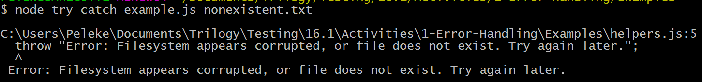
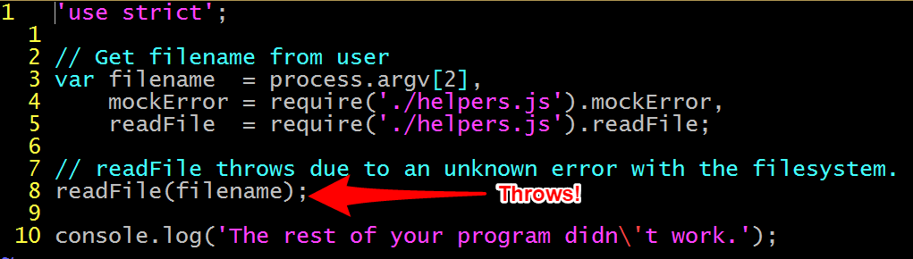
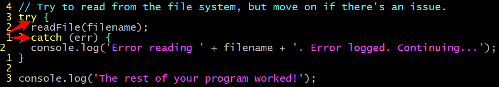
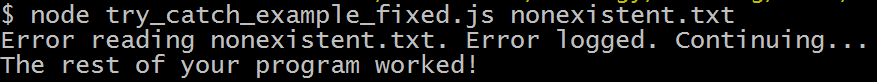
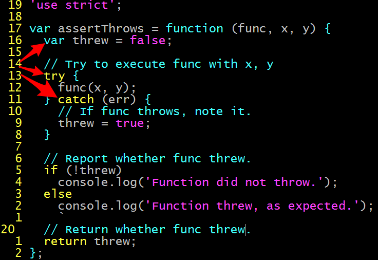
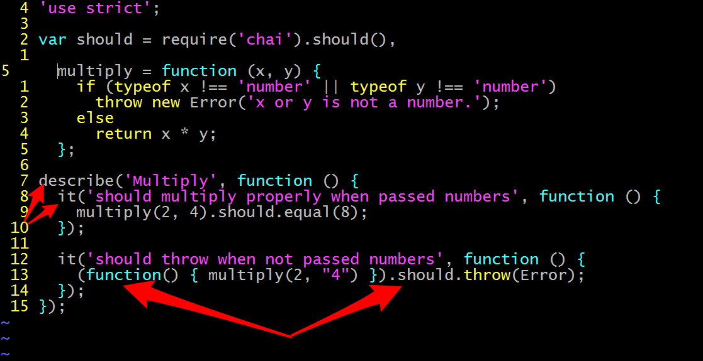
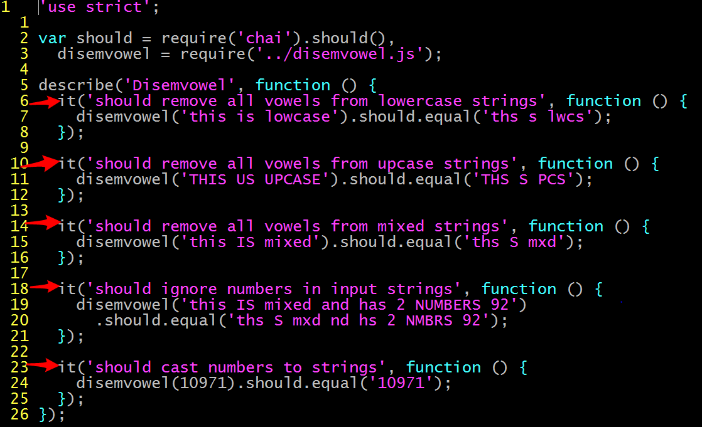
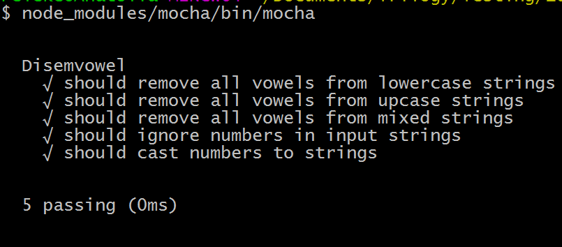
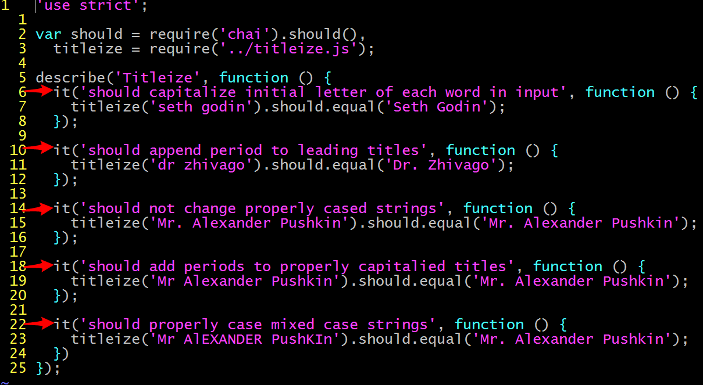

## 16.1 Lesson Plan - Test Your Patience <!--links--> &nbsp; [⬅️](../../15-Week/03-Day/03-Day-LessonPlan.md) &nbsp; [➡️](../02-Day/02-Day-LessonPlan.md)

### Overview

Today's lesson will introduce students to the basics of unit testing using Mocha and Chai, and acquaint them with the requirements of their second project.

`Summary: Complete activities 1-5 in Unit 16`

#### Instructor Priorities

Students should be able to:

* Articulate the utility of unit tests;

* Incorporate Mocha and Chai into a Node project;

* Use Mocha to run unit tests written with Chai;

* Develop and submit a project proposal for instructor review.

#### Instructor Notes

* Please review `02-Project-Requirements/README.md` before class today!

* Remember&mdash;student projects are priority this week. Feel free to abbreviate today's lesson to accommodate project work.

* In the beginning of class, explain that, as this is project week, lesson plan material will only account for half the day's length.

  * For continuity's sake, explain that we'll cover testing material _first_, so students can focus on projects for the rest of the period.

* Have your TAs refer to the [Time Tracker](01-Day-TimeTracker.xlsx) to stay on track.

### Sample Class Video (Highly Recommended)
* To view an example class lecture visit (Note video may not reflect latest lesson plan): [Class Video](https://codingbootcamp.hosted.panopto.com/Panopto/Pages/Viewer.aspx?id=b54ac805-aa00-41c7-920f-ea0e90452862) 

- - -

### Class Objectives

Students should be able to:

* Recognize when unit tests are appropriate;

* Use Mocha and Chai to write tests against a given function;

* Describe a feature in terms of unit tests; and

* Develop and submit a project proposal for instructor review.

- - -

### 1. Instructor Do: Motivate Automated Testing (5 min.)

* Begin by asking different students how they make sure their code is working as expected.

  * Many, if not most, will respond with various combinations of log statements and manually checking browser behavior.

  * Point out that this is a time consuming and error-prone to test code. To the first point, taking the time to call functions and reload pages with different configurations can take up to a minute at a time. To the second, point out that it´s difficult to ensure you execute the same click sequences with the same settings in different configurations&mdash;e.g., checking behavior in Firefox vs Chrome.

* Explain that manual testing is useful in certain cases, but that it simply doesn't scale.

* Explain that tests are programs that automatically check the validity of your programs.

* Explain how this eliminates certain problems of scalability.

* Testing can feel unnatural at first. Reassure students that it becomes clear with practice.

- - -

### 2. Instructor Do: Error Handling with try/catch (10 min.)

* Explain that we'll take a look at handling errors before discussing test _per se_.

* Explain that students will encounter two (very) broad classes of problems in their programs:

  * Bugs, or code that "works incorrectly"; and

  * Errors, sometimes called exceptions, caused by code that fails due to unhandled **exception**al circumstances.

* Run `01-Error-Handling-Example/tryCatchExample.js`, and demonstrate that the program reports an error.

_Uncaught error kills execution._

* Open and execute `try_catch_example.js`. The script simulates a file system error, to avoid complicating things with an explanation of why `fs.readFile` doesn't lend itself to "normal" `try`/`catch` handling.

* Explain that when JavaScript hits an error like this, its default behavior is to kill execution and check if there is any code prepared to _handle_ the error. Point out that the log statement after the line that causes the error doesn't execute.

_Problem code that raises an unhandled error._

* If there is no such code, the program dies.

* Explain that we can modify this behavior by wrapping problem code in a try/catch block.

_A try/catch block wrapped around our problem code._

* Modify the example file to include a try/catch block. Catch the error, print to the command line that something went wrong, and demonstrate that the log statement after the error executes fine.

_Catching the error allows execution to continue._

* Explain that errors like this can kill our programs. This is what happened before we added a `try`/`catch` block.

  * Point out that we have a chance to handle even these otherwise fatal errors.

  * Explain that, when things go wrong, JavaScript engines wrap errors and _throw_ them where they occur.

  * Explain that the engine then looks for code that can handle the error.

    * Explain that such code is said to **catch** the error.

    * Explain that, if it finds such code, the engine allows it to deal with the problem, and then continues execution from where the error was thrown.

    * Explain that, if it _doesn't_ find such code, the engine kills execution, and the program dies.

      * At this stage, there is no need to explain the detail that the Engine walks the call stack in search of a `catch` clause.

* Explain that this allows us to build programs that handle errors gracefully.

  * Point out that `try`/`catch` is useful for recovering from unpredictable errors due to factors out of your control, such as I/O or network issues.

- - -

### 3. Students Do: Check for Exception (10 min.)

* Explain that, when we write tests, we'll often need to check that a function throws an error.

Slack out the following folder and instructions:

* **Folder**: `02-Check-For-Exceptions`

* **INSTRUCTIONS**:

  * Create a function, called `assertThrows`, which takes an argument called `func`, and calls it as a function.

  * Create another function, called `multiply`, which prints the result of multiply 2 and 2.

  * Use `assertThrows` to call `multiply` by passing `multiply` in as the `func` parameter.

  * Next, update `multiply` to accept two arguments, `x` and `y`, and returns the result of multiply them.

  * Update `assertThrows` so that it can call `multiply` with two arguments.

  * Ensure everything works by using `assertThrows` to print the result of multiplying two numbers.

  * Next, update `multiply` so that it throws an error if either `x` or `y` is not a number, and returns the result otherwise.

  * Finally, update `assertThrows` such that it prints 'Function threw.' to the console, and returns `true`.

- - -

### 4. Instructor Do: Review Activity (5 min.)

* Open `02-Check-For-Exceptions/Solved/assert.js`, and walk through the solution.

* This is a reasonably abstract exercise. Focus on:

  * Passing functions as arguments. Emphasize that functions are just like any other value, and can be passed and called elsewhere.

  * Passing the arguments `x` and `y` so that they're in scope for `func`.

  * Using `try` to anticipate an error, and `catch` to take a non-failure path in recovery.

_Solution to the assert exercise._

* Explain that this level of abstraction is characteristic of tests, and becomes natural with practice.

- - -

### 5. BREAK (10 min.)

- - -

### 6. Instructor Do: Mocha + Chai (10 min.)

* Explain that, just as jQuery provides utilities for manipulating the DOM, libraries like Mocha and Chai provide utilities for testing, such as `assertThrows`.

* Install Mocha and Chai.

  * To install Mocha: `npm i -g mocha`

  * To install Chai: `npm i -g chai`

  * If students prefer to install locally: `npm i -D chai`

* Write your own example of requiring and using Mocha and Chai, or simply walk through the provided `index.js` in `03-Mocha-Chai-Example/test/test.js`.

* Explain the structure of a Mocha test suite. Focus on:

  * The `describe` clause;

  * The `it` clauses;

  * The phrasing of `should` clauses; and

  * Why we need an anonymous function to test if `multiply` throws. Don't spend undue time on this if students are obviously confused.

_Describe, it, and should clauses: Building blocks of good unit tests._

* Point out that this structure is intuitive enough so as to hardly require explanation beyond the `describe`/`it` structure.

* Point out that we described two characteristics of the `multiply` function. Explain that good tests will:

  1. Test the behavior of a function on _representative examples_ of expected input; and

  2. Account for unexpected input.

- - -

### 7. Partners Do: Mocha + Chai Documentation, Testing disemvowel (15 min.)

* Slack out the links to the Mocha and Chai documentation.

Slack out the following folder and instructions:

* **Folder**: `04-Disemvowel`

* **INSTRUCTIONS**:

  * Familiarize yourself with the Mocha and Chai documentation. Choose to read either the should, expect, or assert guide, and refer to it throughout the exercise.

  * Consider a function, called `disemvowel`, which accepts a string and returns a version of the string without vowels.

  * Your task is to use Chai to write a test suite for `disemvowel`. The catch is that you don't get an implementation yet. First,

    * With your partner, determine what a "representative example" of an input to `disemvowel` might be.

    * What do we expect to receive? What should the function return of this input?

    * What different formats can this sort of input take?

    * What _don't_ we expect? What should happen in this case? _Hint_: Just come up with something reasonable. We're not going to make you guess how we handled errors, so you don't have to write a test for this.

  * When you think you're done, explain to your partner why the test you've written totally describes `disemvowel`. Be prepared to explain your test suite to the class.

- - -

### 8. Instructor Do: Review Activity (5 min.)

* Review the solution in `04-Disemvowel/Solved/disemvowel.js`.

* Explain each `it` clause.

* Encourage students to update their solutions to correspond to yours. This way, more of them will be motivated when their tests against `disemvowel.js` pass.

_It clauses in the disemvowel test._

* Explain that the purpose of this exercise is to learn to write tests that describe a _what_ a function does without worrying about _how_ it does it.

* This is a powerful concept. It allows us to write tests _before_ we write implementations, thus providing us with checks that our program behaves as expected that we can incrementally satisfy as we actually implement it.

* Slack out the file `disemvowel.js`, and encourage students to run their tests against it. Explain that the solution is intentionally cryptic, to drive home the point that writing tests can be done independently of considering implementations.

* Hopefully, several groups will enjoy passing tests against a function they've never seen.

_Passing tests for disemvowel._

- - -

### 9. Partners Do: Test titleize (15 min.)

Slack out the following folder and instructions:

* **Folder**: `05-Titleize`

* **INSTRUCTIONS**:

  * Your task is to write tests for a function that title-cases incoming names. For example: `titleize('mr jones')` returns 'Mr Jones'.

  * **Bonus:** create an array of titles, such as Dr; Mr; Ms; etc. If the string begins with such a title, capitalize it, and append a period.

  * Proceed as with `disemvowel`, considering:

    * What constitutes a "representative expected input"?

    * What is unexpected input? How do you want `titleize` to respond to this?

    * Do you want to allow arbitrarily long names, or impose a cutoff? _Hint_: There's no right answer, here. Choose an implementation, and write a test reflecting your choice.

  * Once you've written your tests, run them to ensure they fail.

  * Next, start implementing `titleize`. Pass one test at a time.

  * Once you've passed all tests, congratulate yourself! Be prepared to explain your tests to the rest of the class.

- - -

### 10. Instructor Do: Review Activity (5 min.)

* Ask a group to explain why they believe their tests are sufficient. If they don't think they are, ask them what they could do to improve them.

* Review the solutions in `05-Titleize/Solved/titleize.js`. Explain why each test case is necessary to completely determine the method's function.

_Tests for titleize._

* Encourage students to practice writing at least a few tests in every project. Emphasize that they don't have to test _everything_&mdash;but push them to always test at least _something_.

* Spend the remainder of your time answering student questions; relating your own thoughts on testing; and discussing best practices.

- - -

### 11. Instructor Do: Present Project Requirements (20 min.)

* Open and present the `Project-Resources/Slide-Shows/DataProject.pptx`. Use the **Teams** slide as a cue to break students into groups.

* Slack out the `Project-Resources/Slide-Shows/DataProject.pptx`, so students can review the project requirements at their leisure.

  * Alternatively, just slack out the `Project-Resources/README.md`.

* Remind students that they will need to complete and submit a half-page project proposal before class ends.

  * The purpose of the proposal is to ensure that students take up a project that meets the requirements, but is not excessively ambitious.

  * To that end, explain that this proposal should simply articulate the primary functionality of the proposed application, and outline the tools that will be used to build it.

- - -

### 12. Students Do: Brainstorm & Project Sketch (70 min.)

* Allow students to spend the remainder of class brainstorming their project ideas.

* Consider hosting "workshop consultations", in which the instructor and TAs check in with each group to offer advice.

  * The instructor and each TA should work with different groups individually.

    * i.e. there should always be three workshops in progress.

  * Optimally, each group will finalize a project proposal _during_ the workshop, and spend the rest of class laying the groundwork for their projects.

    * If a group is unable to finalize a project proposal during workshop, simply defer to the initial deadline of end of day.

* This approach works best if you can remove students from the classroom to an adjacent space. Consider hosting workshops even if this isn't feasible.

  * This allows 12 groups to receive 15-minute consultations in 60 minutes.

* At the end of class, remind groups to slack instructors and TAs their project proposals for review.
