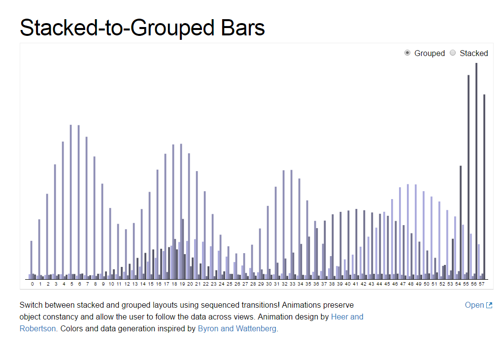
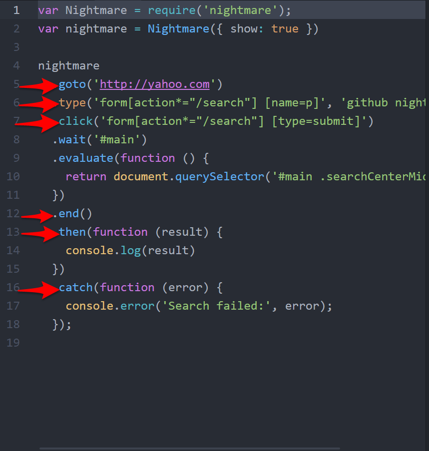
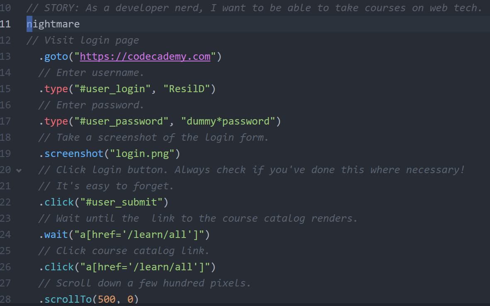
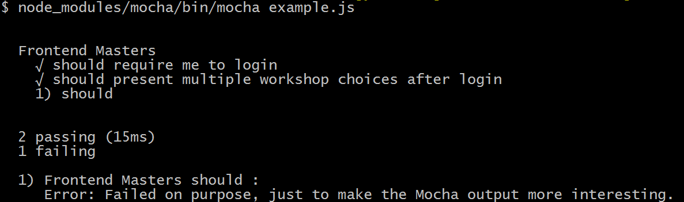

## 16.2 Lesson Plan - Sweet Dreams with Nightmare.js <!--links--> &nbsp; [⬅️](../01-Day/01-Day-LessonPlan.md) &nbsp; [➡️](../03-Day/03-Day-LessonPlan.md)

### Overview

In this class, we will be introducing students to the principles of user stories and functional testing using Nightmare.js.

`Summary: Complete activities 6-8 in Unit 16`

#### Instructor Priorities

* Students should be able to: 

  * Articulate the differences between functional and unit testing.

  * Understand how to integrate Nightmare.js into a Node project.

  * Draft basic user stories to describe common pathways through their applications and to use Nightmare to verify that their application behaves properly in these circumstances.

#### Instructor Notes

* If you haven't already, please review `02-Project-Requirements/README.md` before class today.

* Remember that student projects are the priority this week. Feel free to abbreviate this lesson plan by skipping or shortening activities as you see fit.

* Testing is largely a thing of habit. As such, today's lesson will largely consist of activities. Once you've given an overview of Nightmare's API, give students the bulk of class to practice.

* The goal for today is specifically to get students comfortable with drafting user stories and implementing them with Nightmare. They are free to write tests against arbitrary websites to do so.

* Have your TAs refer to the [02-Day-TimeTracker](02-Day-TimeTracker.xlsx) to stay on task.

### Sample Class Video (Highly Recommended)
* To view an example class lecture visit (Note video may not reflect latest lesson plan): 
[Class Video 1](https://codingbootcamp.hosted.panopto.com/Panopto/Pages/Viewer.aspx?id=30b5c996-e7db-4a75-8537-60d90eab4dcd)
[Class Video 2](https://codingbootcamp.hosted.panopto.com/Panopto/Pages/Viewer.aspx?id=5a5bdcf4-0685-43e3-9469-9552c867880f)

- - -

### Class Objectives

* To gain initial exposure to functional testing in JavaScript.

* To gain initial exposure to Nightmare.js.

* To use Nightmare to verify a website's behavior.

- - -

### 1. Instructor Do: User Stories & Nightmare (10 mins)

* Ask a student to explain what unit tests are and what they're used for.

* Ask several students if they can think of any shortcomings of unit tests.

* Point out that while unit tests guarantee that our functions work properly, they don't necessarily guarantee that they coordinate properly.

* Explain that the purpose of _functional_ tests is to ensure that these units work together properly. We can accomplish this by verifying that particular _features_ of an application function as expected.

  * Point out that a feature&mdash;such as saving user data&mdash;requires many _units_ to function.

  * Emphasize that good unit tests typically verify only _individual units_ of functionality.

  * Explain that since features involve the coordination of many such units, functional testing demands a different approach.

      
      _Ask students how testing a visualization like this might be different from testing the functions that produce the data._

* Explain that functional tests verify whether features work as the _user_ expects. Unit tests verify that the logic works as the _programmer_ expects.

* Explain that functional tests are generally written in terms of the user's expectations of a feature. Some examples include the following:

  * Google allows users to enter a search term, then directs them to a page with search results.

  * Facebook allows users to like something a friend shared, then displays how many users have liked that item.

  * Dropbox allows users to drag files to the browser, then uploads that file to a database.

* Explain that such functionality, expressed briefly in a sentence or two, constitutes a _user story_.

  * These often follow a template: as a _user_, I want to &lt;_action_> so I can &lt;_reason_>.

* Give a few examples:

  * As a user, I want to send tweets so others can read them.

  * As an Android user, I want to be able to search for apps by name and to sort them by rating.

  * As a Node developer, I want to be able to easily download code others have written so I can develop more quickly.

    * Explain that user stories of this magnitude would be broken down into a series of smaller ones.

* Tell students that just as there are libraries such as Chai that ease unit testing, there are libraries that ease functional testing.

* Slack out the Nightmare.js GitHub page: <https://github.com/segmentio/nightmare>

* Explain that Nightmare effectively launches a browser and interacts with it as if it were a user.

* Quickly run the example script from the Nightmare page. This is copied for convenience in `06-Nightmare-Example`.

    
    _Important Nightmare methods._

* Explain what happened, and briefly explain a few of Nightmare's methods. If time allows, ask a few students to name some common browser interactions. See if there are any Nightmare methods that correspond to them.

* Alternatively, mention that some of the most commonly used are the following:

  * `goto(url)`: Navigate to `url`.

  * `click(selector)`: Click the element represented by `selector`.

  * `back()`: Navigate to the previous page.

- - -

### 2. Students Do: Browser Automation with Nightmare (15 mins)

* Tell students to create a new NPM project.

* Install Nightmare locally: `npm install --save-dev nightmare` or `npm i -D nightmare`.

* Slack out the following instructions:

  * **Folder**: `07-Browser-Automation`

  * **INSTRUCTIONS**:

    * Make sure you've installed Nightmare locally: `npm install --save-dev nightmare` or `npm i -D nightmare`.

    * Refer to the Nightmare documentation here: <https://github.com/segmentio/nightmare#api>

    * Choose a site with which you're familiar. Write a few user stories for it.

    * Using the Nightmare documentation, try to implement a few of your user stories.

    * Take a look at the `screenshot` and `html` methods. Try to use them. Can you think of any use cases for these methods?

    * Be prepared to share your user stories with the class.

    * _Hint_: If you have trouble interacting with elements you expect to be on the page, try using `wait`. Don't forget to use your browser's dev tools to determine the correct element selectors! Use `06-Nightmare-Example` as a starting point if you feel overwhelmed.

- - -

### 3. Instructor Do: Review Activity (10 mins)

* Ask a few students to share their user stories.

* Refer to the example in `07-Browser-Automation/Solved`. Use one you created beforehand, or live-code one similar to the provided example.

    

    _Important methods in the Codecademy demonstration. Use the screenshots to demonstrate the flow._

* Walk through the logic.

* Take some time to answer student questions.

- - -

### 4. Break (10 mins)

- - -

### 5. Instructor Do: Nightmare & Mocha	(5 mins)

* Point out that we can use Nightmare to automate browsers this way but that we'll generally want a report on whether the application behaved as expected.

* Explain that we can use Nightmare in conjunction with Mocha to encapsulate our user stories in `describe` and `it` clauses and to generate test reports akin to those we get when unit testing.

* Open up `08-Nightmare-Tests-Example`, run the tests, and briefly explain the output.

* Break one of the tests and demonstrate how this changes the test report.

    
    _Nightmare's test output should look pretty familiar._

- - -

### 6. Partners Do: Test, Test, Test!(35 mins)

* Slack out the following instructions to students:

  * **Folder**: `08-Nightmare-Tests-Example`

  * **INSTRUCTIONS**:

    * The purpose of this exercise is to get experience writing tests that specify how a site will behave.

    * Choose a website with which you're familiar, and write a few user stories for it. Be sure not to write user stories against arbitrary features. Rather, write them such that taken together, they verify some of the site's primary functionality.

    * Wrap those user stories in `describe` and `it` clauses.

    * If you can get everything to pass, repeat the exercise for a different site.

- - -

### 7. Instructor Do: Review Activity (5 mins)

* Ask a few groups to explain their user stories.

* Return to the example in `08-Nightmare-Tests-Example`.

  * Explain the implementation, but don't belabor it. Rather, focus on the logic behind choosing these tests.

  * Explain that the tests, taken together, verify a primary subset of the site's core functionality. In other words, they _specify_ how this feature should work.

* Point out the relationship between functional tests and specifications.

* Explain that it's good practice to write tests _before_ writing your implementations.

  * Even if you change your tests after writing the application code, writing these tests beforehand helps clarify the application's functionality.

  * Tests provide you with a verification layer to ensure that you're on the right track as you develop.

  * A test suite notifies you when you introduce bugs while working on new, potentially unrelated features in the future.

* Answer any questions about the Nightmare API, user stories, and tests in general. Encourage students to write at least a few tests for every project on which they work, and gradually work towards writing tests for every feature.

  * Emphasize that this is an ideal. Students shouldn't feel obligated to test _everything_. Rather, they should aim to write tests regularly.

### 8. END
