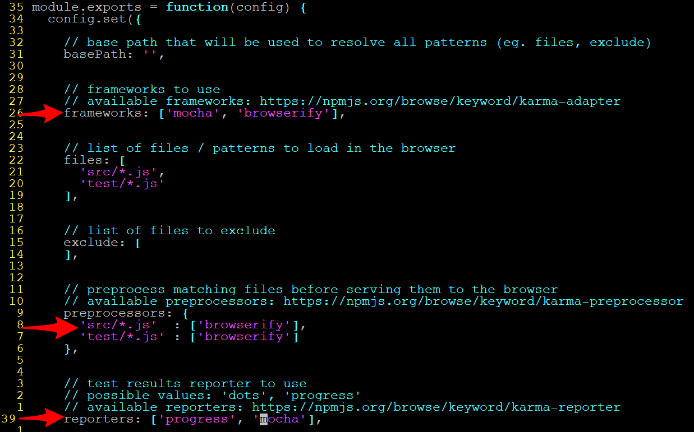
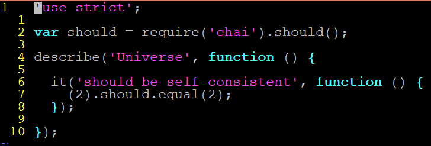
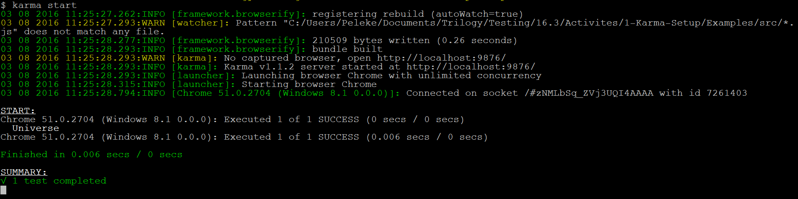
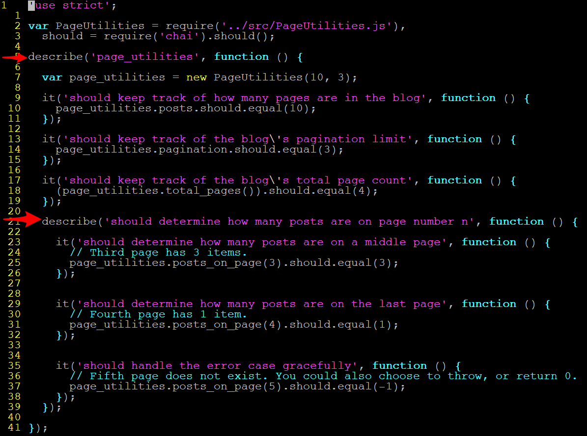
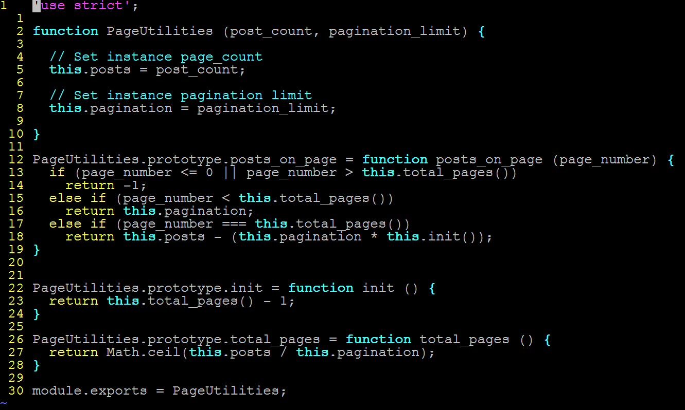
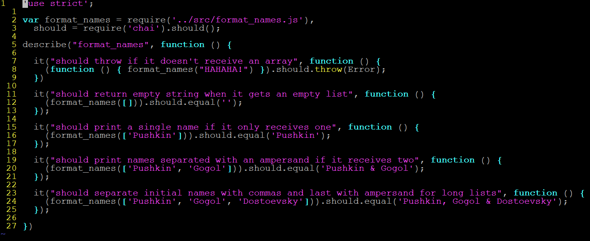
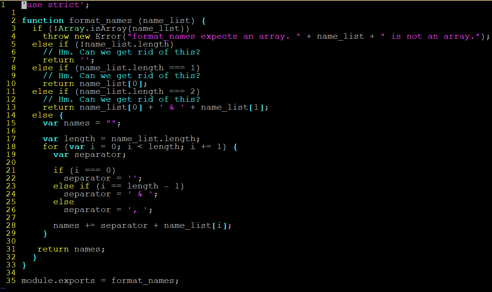
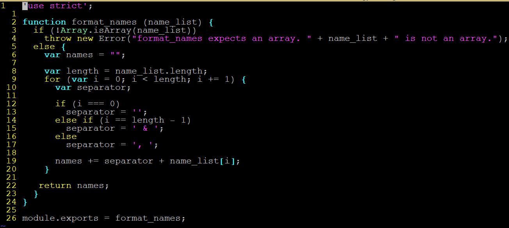

# 16.3 Lesson Plan - Test-Driven Development <!--links--> &nbsp; [⬅️](../02-Day/02-Day-LessonPlan.md) &nbsp; [➡️](../../17-Week/01-Day/01-Day-LessonPlan.md)

### Overview

* This lesson will introduce students to the discipline of test-driven development (TDD).

`Summary: Complete activities 9-12 in Unit 16`

#### Instructor Priorities

* Students should be able to articulate the benefits of TDD and of its relationship to design.

* Students should know how to incorporate a TDD workflow into any development project.

* Students should be able to write focused tests.

#### Instructor Notes

* If you haven't already, please review `02-Project-Requirements/README.md` README before class today!

* Testing is as much a habit as an engineering discipline. As such, today's lesson largely consists of activities so that students develop practical familiarity with the TDD workflow.

* Bear in mind that student projects take priority. Feel free to omit activities or otherwise abbreviate the lesson plan if necessary.

* Have your TAs refer to the [Time Tracker](03-Day-TimeTracker.xlsx) to stay on task.

### Sample Class Video (Highly Recommended)
* To view an example class lecture visit (Note video may not reflect latest lesson plan): [Class Video](https://codingbootcamp.hosted.panopto.com/Panopto/Pages/Viewer.aspx?id=c43786f6-2c5a-4128-ba99-1e8ec5580388)

- - -

### Class Objectives

* To develop familiarity with a test-driven workflow.

* To develop familiarity with testing tools.

* To develop the habit of writing automated tests for application code.

- - -

### 1. Instructor Do: Testing Workflows (10 mins)

* Emphasize that it's important to write tests as early as possible and, preferably, to write them before implementing any non-trivial functionality.

* Explain that the practice of writing tests for a feature _before_ implementing the feature is called **test-driven development** or TDD.

* Emphasize that TDD affords numerous advantages, including the following:

  * Helping design a feature's API.

  * Providing persistent QA for any feature with a test, which helps guard against regressions.

  * Documentation of a feature's intended functionality and error handling.

* Point out that such a workflow, while ideal, can be time consuming because manually running tests as often as TDD requires quickly becomes sluggish.

* Explain that there are tools which will automatically run your tests whenever you update any of your project's JavaScript.

* Explain that [Karma](https://karma-runner.github.io/) is one such test runner. Have students install the following tools, briefly describing each in turn:

  * `npm i -g karma-cli` allows you to initialize a Karma configuration file in any directory.

  * `npm i -D karma karma-chrome-launcher karma-commonjs karma-browserify browserify watchify mocha chai karma-mocha-reporter`

    * `karma-chrome-launcher` allows us to launch a test report in Chrome.

    * `karma-mocha` allows us to run our tests with Mocha.

    * `karma-browserify` allows us to use `browserify` and `watchify`. Explain that Browserify allows us to use Node's `require` in scripts we run in the browser.

    * Note that we need local installations of `mocha` and `chai` for our tests to run properly.

    * Finally, point out that `karma-mocha-reporter` prints test results to the command-line, just like Mocha.

  * Explain that Karma's configuration options go in a file called `karma.conf.js`.

  * Explain how to create a new `karma.conf.js` with `karma init`. Have students run this command, and walk students through the following steps:

    * Tab to `mocha` for the testing framework.

    * Tab to `no` when prompted about RequireJS.

    * Select `Chrome` when prompted to capture browsers automatically. Don't add other browsers.

    * Add `src/*.js` and `test/*.js` as the locations for your source and test files.

    * Enter nothing when prompted about exclusions.

    * Select `yes` when prompted about Karma's watching files and running tests on change.

    * This creates a file called `karma.conf.js`. Open it, and guide students through the following changes:

      * Find the section that says `frameworks` and add `"browserify"`.

      * Find the section that says `preprocessors` and add a key that reads `'test/*.js'` whose value is `["browserify"]`.

      * Find the section that says `reporters` and add `"mocha"` behind `"progress"`.

          
          _Configuration options that need changing._

    * Save the file.

    * In `test`, add a trivial test, such as the provided `testSanity.js`.

        
        _A trivial test to show what Karma´s default output should look like._

    * Run `karma start`.

    * Students should see a test report.

        
        _Karma's default output._

* Expect students to have issues with setup. Make sure your TAs are available to troubleshoot.

### 2. Students Do: Test-Drive multiply (10 mins)

* Once everyone is set up, Slack out the following warm-up instructions to students.

  * **Instructions**

    * Using your Karma setup, write tests for the `multiply` function we met in our last class. Make sure to test that it handles errors properly.

    * After you've written tests describing the behavior of `multiply`, open a terminal and start Karma.

    * In another terminal, write your implementation for `multiply`. Notice that Karma executes your tests every time you change your implementation.

### 3. Partners Do: Test-Drive PageUtilities (35 mins)

* Show the `10-Test-Drive-Multiply/Solved`, and ask if anyone needs clarifications. Answer any questions that come up, and Slack out the solution file.

  * Try not to spend too much time reviewing. Treat this as a warm-up exercise&mdash;move on immediately, if possible.

* Slack out the following instructions:

  * **Instructions**

    * Write a class that can do the following:

      * Keep track of how many blog posts a blog maintains on each page.

      * Keep track of how many blog posts the blog contains.

      * Determine how many posts are on page number `n`. It should behave sensibly if the blog does not have a page `n`.

    * Before implementing any of this functionality, develop a test suite with your partner describing the desired behaviors.

    * _Hint_: You'll have to come up with method names too. Write some code that uses the object you're about to create. What seem like natural choices for the object and for its methods' names?

### 4. Instructor Do: Review Activity (10 mins)

* Ask a group to describe the tests they wrote.

* Open the final test in `11-Page-Utilities/Solved`. Explain why each test is present.

_Multiple clauses describing page utilities._

* Open the final implementation of `PageUtilities` in `11/Page-Utilities`. Briefly explain the implementation.

    
    _The PageUtilities class itself._

* Slack out the above two files.

- - -

### 5. BREAK (10 mins)

- - -

### 6. Partners Do: Test-Drive format_name (35 mins)

* Slack out the following instructions to students.

  * **Instructions**

    * Your task is to write a function that accepts an array of names and that produces the following kinds of output:

      * For `['Pushkin']`: `Pushkin`.

      * For `['Pushkin', 'Gogol']`: `Pushkin & Gogol`.

      * For `['Pushkin', 'Gogol', 'Zamyatin']`: `Pushkin, Gogol & Zamyatin`.

    * With a partner, write unit tests against this behavior. Once you've described the function sufficiently, kick up a Karma server, and begin implementing the function.

    * Do your tests completely describe the function? Be ready to explain why or why not.

### 7. Instructor Do: Review Activity (10 mins)

* Open the solutions in `12-Format-Name/Solved`.

* Open `test/formatameTest.js`. Explain why each `describe` clause is present.

    
    _Tests for formatName._

* Open `src/formatName.js`. Briefly explain the implementation.

    
    _Implementation of formatName._

* Draw attention to the extra `else if` branches. Are they necessary?

* Kick up a Karma server. Eliminate the `else if` branches, and demonstrate that our tests still pass.

* Point out how valuable it is to be able to make such changes to our implementation, and be certain that it still works at least as well as before.

    
    _Cleaner implementation of formatName._

* Slack out the above two files.

### 8.	END
